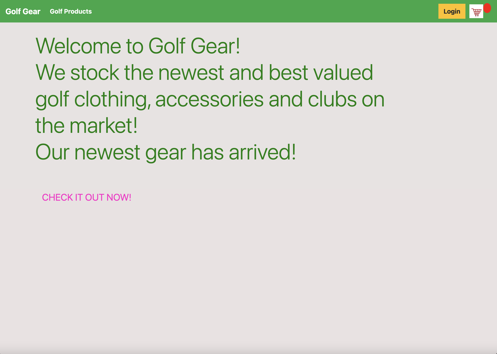

# Project 5 Ecommerce - Golf Gear

Golf Gear is a website in which all avid golfers will love!  It allows all shoppers to visit, browse, create an account and finally purchase the items they desire.
A user will visit the site, be greeted with colourful and easy to navigate pages.  They can view all the products that are available, which range from clothing, clubs and accessories - everything a golfer needs!
In order to purchase an item, the user must create an account, which they can do easily via an available link, and by just filling in a few details - they are ready.
Once a user is logged in, they can then select any items in which they want to purchase... add them to thier basket and purchase...all with 4 clicks of a button and entering delivery information.
If the logged user can not make up thier mind and wish to log off and have a think...they can do so without issue - the next time they log in, thier basket items will still be held for them!
We accept payment via Paypal or Credit Card!
Enjoy the Site!

# Agile Methodology/Framework
- A big part of this project was to think ahead and plan, design, prioritise and timebox tasks.  It was a great way to make me think about smaller chunks of work and plan out my project.
- By more planning I felt that I could conceptulise and not get too far ahead, allowing me to focus on certain items of delivery, step by step, not to just focus on end result. 
- I learned how to use this via github and to break tasks down into manageable chunks of work, and again to focus on these as MVP vs everything I'd like to deliver. 
- CRUD - I've designed, planned and executed all of the CRUD functions.  My application allows a user to:-
    - Create - New Accounts, new shopping items
    - Read - Information is collected and stored, and is made readable on UI via the database. 
    - Update - Current stored data can be changed and updated, and again made visible on UI via database.
    - Delete - Stored information can also be deleted.  This information is then rendered on UI via database.

# UI Designs 
- Part of the Agile design was to deisgn UI Mockups prior to coding and constructing.
- This is a good practise to allow me to visualize how the product will look and feel and to put myself in the users shoes from a visual point of view..
- I did mockups of all my pages (Home Page, main product page, basket, checkout) All these mockups can be found [HERE](https://drive.google.com/drive/folders/1nCceR4MK3c5pIexAGs8ByDaan0efUXiN)

# Features

There are many features included in the shopping list application.

- __Secured Credentials__
    - A user must have login credentials to use the site
    - With login credentials, a user can only view thier own details
    - There is a create account function to allow users without login to create one and use site straight away.

 

- __Easy Navigation__
    - A user can easily navigate through the site via clear links and one click utilisation.
    - Pages are clear and concise, with no confusion
    - Clear instruction on options to add/edit/remove items from list.

 

- __Mobile Friendly__
    - Application is very device friendly.  This is very important for this app in particular to allow users to use on the go, when at shops for exmaple.  

 

- __Notifications/Messaging__
    - When actions complete by user, messaging appears to inform of success.

 

- __Bakset__
    - When a user adds an item from the product pages to the basket, the basket item numbers will automatically increment and will display this on the basket icon displayed on top corner of product page.
    When the user is happy that they have chosen all they want and have added to basket, they can then navigate easily to the basket where all the items chosen will be displayed along with images, descriptions, unit price and overall price of order.
    Another great feature in teh basket, id that a user can add to items...so by using an up or down arrow, the user can increase or decrease items required... the overall items will update along with overall cost of order... if the user wants to completely remove the item, the down arrow icon can be used until items =0...the item will automatically remove from basket and total updated.

 

- __Purchase__
    - The user will experience a seamless purchasing experience.  Once they have viewed thier basket and happy with the items and cost...they will have the option to 'Checkout'.  This will bring them to a page which will once again display the items being purchased with totals, and also a form in which to enter shipping details for thier order.
    - Once the user has completed with shipping details, the user will then be prompted with payment options...which are Paypal or Credit Card.  Once either selected, the user will be prompted with Paypal options in order to complete thier payments.
    - The Payment integration with Paypal will take over and will deduct the relevant amounts from consumer and add to the seller accounts.
    - Email confirmation is sent to the user with the details outlined.

 

# Features left to implement

- Messaging - The messaging is not as I want it to be, it works for most pages but not all.  I would also like to have the message pop as an alert and not remain on screen

- Overall better UI - I would spend more time on making the user interface a bit more fun and exciting, currently its very basic, with colours a little bland. 

- Guest functionality - My plan was to allow users to avail of all aspects of the site including purchasing items.  So a user would not have to register an account in order to purchase.  As it stands, only a registered user can purchase.
I did attempt to add this functionality, it was very complicated to decipher the items being chosen and added to basket etc from a non registered user.. I spent many hours to try to get this to work.. but I was getting down rabbit holes.  I was trying this via cookies and page elements.. to no avail.

- Multiple pages vs one.  My original plan and layout was to have numerous pages of products for better experience and design.  As I was developing my site and functionality, it was proving really difficult to pull the information when dealing with basket and incrementing items for purchasing etc..so I went back to one page.

- Views of products - As it stands the descriptions are very high level of the products, I would like to have added an option to click into item and to view more about it.... sizes available, colours, and perhaps a zoom option into the product. 

## Testing

- There was a lot of testing throughout this project.  Each and every small change was tested as I went.  I wanted to avoid any last minute bulk testing and therefreo refactoring, so testing as I developed my way through was how I approached this.
 

- A large part of my testing was based on the selection of items and updating of Basket.  This was complicated coding and testing/retesting.. I struggled to make it work, and it took a long time with many hours of testing.
 

- Guest - Again, this took me a long time to try and develop... and of course test throughout.  I felt that it was then taking way too long, and had to make the tough decision to park it.

 

 - **Browser Testing** - As part of my testing I covered Browser testing across numerous platforms, Safari, chrome, firefox and IE.  I wanted to make sure my site worked and was compatible througout and for all users using different browsers.  Results [HERE](https://drive.google.com/drive/folders/1D__6g5NjkQZ9vb3SfgyrLV0bitUlqy8O)
  

 - **Responsiveness** - As well as testing on browsers, it was very important that I verified that my site and all its functions behaved as expected with diffeerent screen sizes along with different devices.  This was also quite heavy lifting to make sure I got this working as expected, responsiveness is something I have struggled with in the past and continue to.. but I'm glad to say that any issues that I was finding, I was able to resolve.  Results   [MOBILE](https://drive.google.com/drive/folders/1NboPbTJ3-2qzwFWJV5NDS561Dms-LZq3) 
 [Screens](https://drive.google.com/drive/folders/1Q5Y-eD_81El7-ErJuMHIA9--oWUL5SSR)
  

 - **Code Validation** - Part of the testing efforts are not just about the functional side of the product, its also very important that its Accessible, Performant and the code has been written using best practises.  It is also important that the code written is in the right format and using correct syntax etc.  I did this testing through the use of a number of tools - Lighthouse, HTML and CSS validators etc.  Again, this took a bit of back and forth with fixing some items, but I feel I have got most of the way there now.  I'm still having issues with some accessibility on on one of the pages inreation to lack of labels on a form - I'm struggling with this while using inherited form input fields in Django.  Results  [Lighthouse](https://drive.google.com/drive/folders/1zLquxiSuvXAekzqiUvh0BfdIq9TkaLUI) 
 [CSS](https://drive.google.com/drive/folders/1f49TG4VLdzKMOCEeol45E1Ezki6Yv-NR) 
 [HTML](https://drive.google.com/drive/folders/1KrVEsrA7aVR8-Q4cXBUwI2BOTyxCjiTJ)

 - **Use Case and Features** - All the above testing is great, but its of no value if the product does not do what it is meant to do!  As mentioned, I did test throughout as I was developing, and made sure that each use case was tested to make sure I was meeting the initial use cases.  While the majority of the use cases pass the test, there were a couple of which I think could be of a better quality.
  Results  [HERE](https://docs.google.com/spreadsheets/d/1a-seLraqeUn-Lllj1iJ2cUO_Y-UU9poS/edit#gid=2126396143) 

 ## Unfixed Bugs

 - As I write this report, a current major issue I have is creating a user account that will also become a customer.. My model set up is with a seperate Customer table outside of the user... so after creating an account the user can not use the site as a customer until I add them via the admin utility... this is a big problem that I have been trying to fix unsuccesfully at this point.

 - Messaging - My messages are being erratic... they seem to present themselves at times and other not.. it really is bothering me.  

 - Guest functionality - I'm not sure if this is a bug neccessarily, but its certainly something that feels like its missing - a website like this should allow no registered users to utilise. 

 